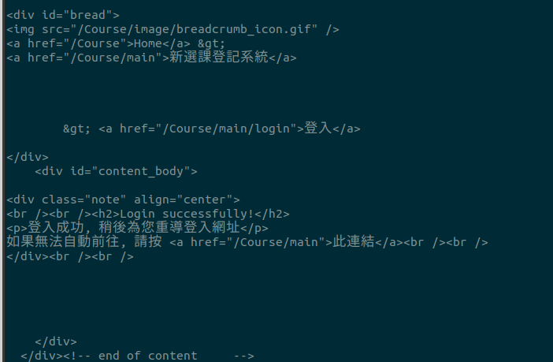
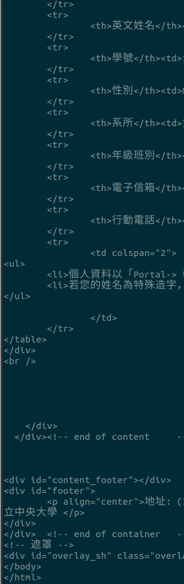

# NCU-course-authorization-shell
it's a shell script for login or getting information from the system (aka cis.ncu.edu.tw )

# Introduction
This script just a example for making self-crawler and getting info from the National Central University Courses System

# How to use
## initialize
following `exmaple.config.sh`
/config.sh
```
username=StuentID
password=YourPasswordHere
```

## Test the app
run `./app/main.sh`
```
cd app
./main.sh
```


# Screenshot

## Using main to login



## After getting personal Information

it's using bash


